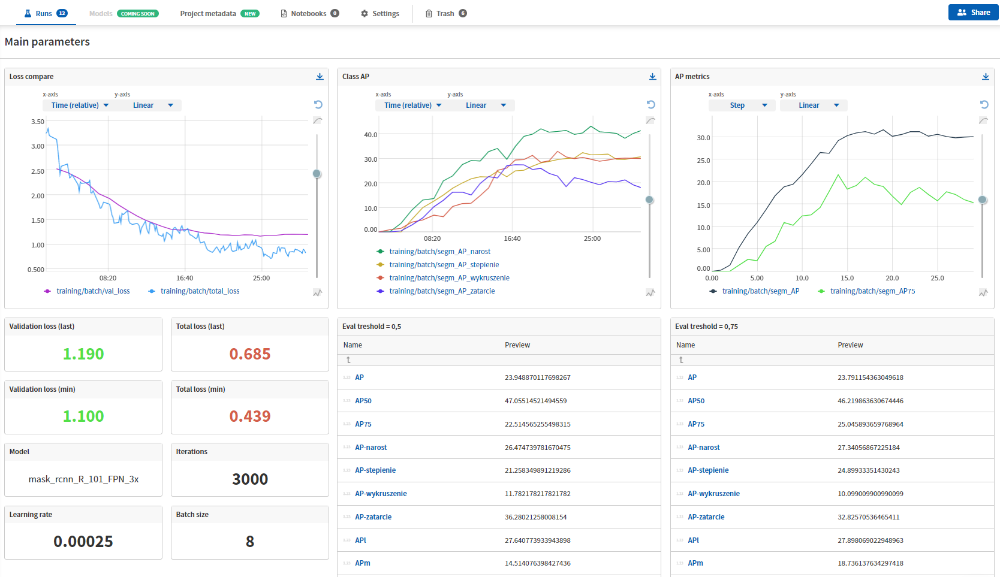
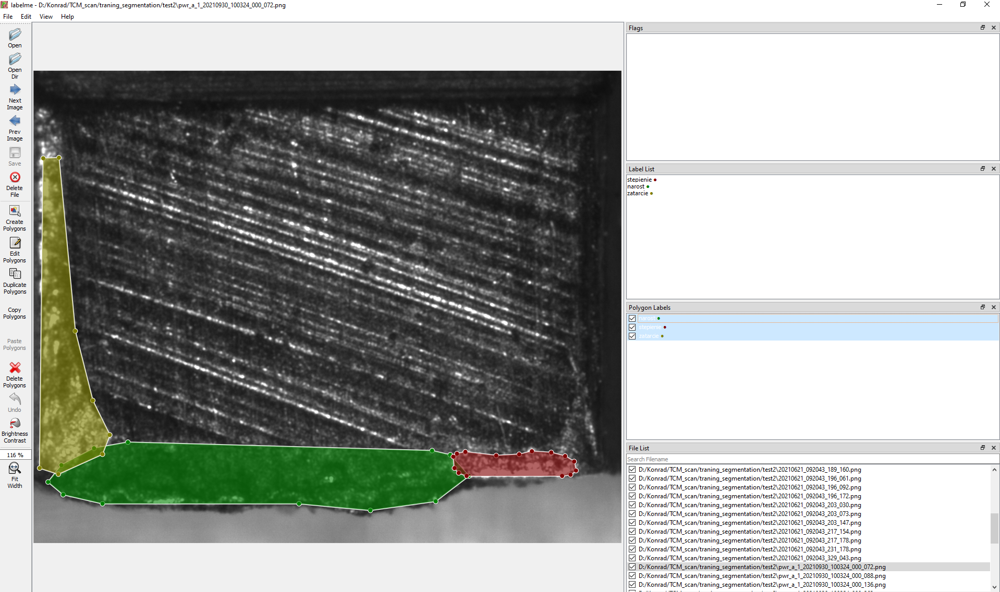

# Broach teeth detection, classification & segmentation, supervized learning 
> This repositorium is a modified version of https://github.com/konrad98ft/TCM_scripts
> 
> Machine vision development software utilized for inspection of the broach teeth. It presents 2 step inference.
> Images captured by the camera are extracted from the background using 1st model, 2nd one is responsible for failures segmentation. 
> Result are displayed in the dedicated application. 

## Table of Contents
* [General Info](#general-information)
* [Technologies Used](#technologies-used)
* [Features](#features)
* [Project Status](#project-status)
* [Room for Improvement](#room-for-improvement)
* [Experiments tracking](#experiments-tracking)

## General Information
- Contains jupyter notebooks for models development purpouses
- Implemented automatic failures annotations in .json labelme compatible format
- Results displayed in dash-based interactive application
- Teeth sharpening strategy optimization
- Saving results in .csv files
- Automatic dataset creation
- Models comparing and results tracking using Neptune.AI

## Technologies Used
- Python 3.7.0
- Detectron2 v0.6
- PyTorch 1.11.0
- Pandas 1.3.5
- OpenCv 4.5.1
- NumPy 1.21.3
- Dash 2.1.0
- Json 2.0.9
- CUDA 11.3

## Features

***Dash application used for output visualization.***

>https://user-images.githubusercontent.com/62110076/153577769-51b06553-928e-471d-a0c0-fc5e0056007a.mp4

MLOPs platform - Neptune AI for experiments tracking pourposes.***
>

***Automatic labels in .json lableme compatible format, generated using detectron2 model inference.***
>

## Project Status
Project is: _in progress_ 

## Room for Improvement

- Integrate Microsoft SQL database with the appliacation
- Collect historic data
- Optimization of the sharpening strategy for teeth

## Experiments tracking
Neptune [click here](https://app.neptune.ai/kacper-marciniak/)
